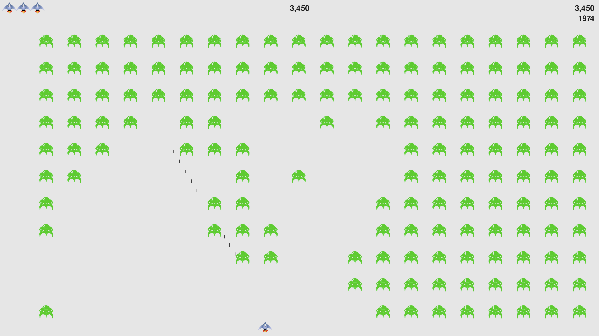
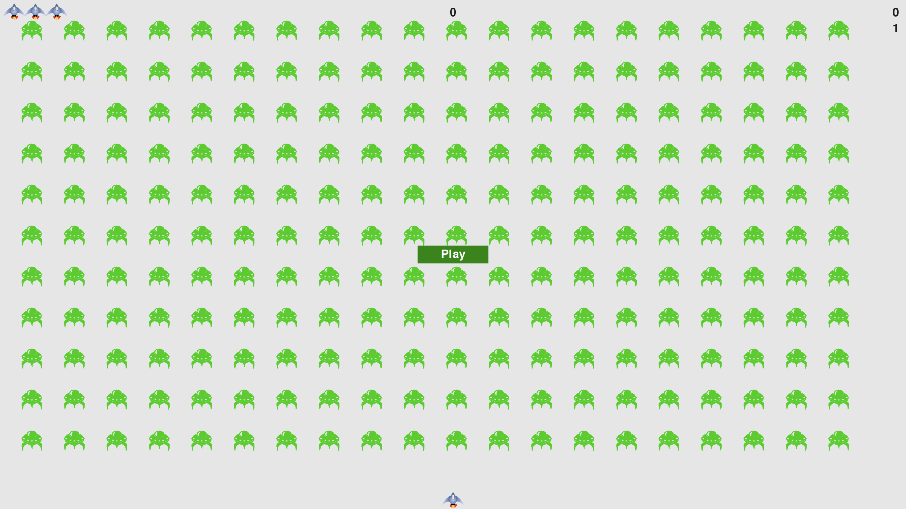

# Alien Invasion


Alien Invasion is a simple 2D shooter game where the player controls a spaceship that must fend off waves of alien invaders. 

## Table of Contents

- [Features](#features)
- [Installation](#installation)
- [How to Play](#how-to-play)
- [Screenshots](#screenshots)

## Features

- Control a spaceship using the arrow keys.
- Shoot bullets to destroy aliens.
- Aliens move faster and drop lower with each wave.
- The game ends when an alien reaches the bottom of the screen or collides with the player's ship.
- Score tracking to see how well you do.

## Installation

To run this game, you'll need to have Python installed on your system. Follow these steps to get started:

1. **Clone the repository:**

   ```bash
   git clone https://github.com/your-username/alien_invasion.git
   cd alien_invasion

2. **Install the required libraries:**

This game requires pygame. You can install it using pip:

    pip install pygame

3. **Run the game:**

    ```
    python3 alien_invasion.py   

## How to Play

- Movement: Use the left and right arrow keys to move your spaceship.
- Shooting: Press the spacebar to shoot bullets at the aliens.
- Objective: Destroy all the aliens before they reach the bottom of the screen or collide with your ship.

## Screenshots






